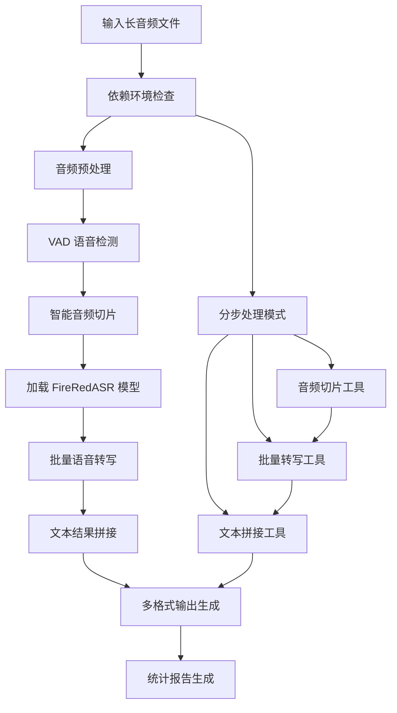

# FireRedASR 长音频处理系统产品需求文档

## 1. 产品概述

FireRedASR 长音频处理系统是一个集成化的语音转文字解决方案，专门针对长时间音频文件（如课堂录屏、会议录音、讲座等）进行自动化处理。系统通过智能音频切片、批量语音识别和文本拼接技术，将长音频文件转换为高质量的文字稿和字幕文件。

该系统解决了传统语音识别模型对音频长度限制的问题，提供了完整的端到端处理流程，显著提高了长音频转写的效率和准确性。目标是为教育、会议、媒体等领域提供专业级的语音转文字服务。

## 2. 核心功能

### 2.1 用户角色

| 角色 | 使用方式 | 核心权限 |
|------|----------|----------|
| 普通用户 | 命令行工具直接使用 | 可使用所有基础转写功能，访问预训练模型 |
| 高级用户 | 自定义参数和批量处理 | 可调整 VAD 参数、选择模型类型、批量处理多文件 |
| 开发者 | API 集成和功能扩展 | 可修改核心算法、集成自定义模型、开发新功能 |

### 2.2 功能模块

长音频处理系统包含以下核心页面和模块：

1. **主处理脚本**: 一键式长音频转写流程，集成所有处理步骤
2. **音频切片模块**: VAD 语音活动检测和智能音频分段
3. **批量转写模块**: FireRedASR 模型批量语音识别处理
4. **文本拼接模块**: 多格式文本输出和时间戳管理
5. **配置管理模块**: 参数设置和模型选择界面
6. **结果展示模块**: 处理进度、统计信息和结果预览
7. **工具集成模块**: 依赖检查、环境配置和故障诊断

### 2.3 页面详情

| 页面名称 | 模块名称 | 功能描述 |
|----------|----------|----------|
| 主处理脚本 | 流程控制器 | 执行完整的四步处理流程：音频准备、VAD切片、批量转写、文本拼接 |
| 主处理脚本 | 参数解析器 | 处理命令行参数：输入文件、模型类型、输出目录、格式选择 |
| 主处理脚本 | 依赖检查器 | 验证 ffmpeg、torch、silero-vad 等依赖的安装状态 |
| 音频切片模块 | 音频预处理器 | 使用 ffmpeg 将输入音频转换为 16kHz 单声道 WAV 格式 |
| 音频切片模块 | VAD 检测器 | 使用 Silero VAD 模型检测语音活动段，生成时间戳信息 |
| 音频切片模块 | 分段切片器 | 根据 VAD 结果切分音频，生成编号的音频片段文件 |
| 批量转写模块 | 模型加载器 | 加载 FireRedASR-AED 或 FireRedASR-LLM 模型 |
| 批量转写模块 | 批处理引擎 | 遍历音频片段，调用 FireRedASR 进行语音识别 |
| 批量转写模块 | 结果管理器 | 保存单个转写结果，记录处理时间和 RTF 指标 |
| 文本拼接模块 | 结果加载器 | 读取转写结果和分段信息，按时间顺序排序 |
| 文本拼接模块 | 格式生成器 | 生成 TXT、SRT、VTT、JSON 等多种输出格式 |
| 文本拼接模块 | 统计分析器 | 计算总时长、字符数、成功率等统计信息 |
| 配置管理模块 | 参数验证器 | 验证输入文件存在性、模型路径有效性 |
| 配置管理模块 | 默认配置器 | 提供 VAD 参数、解码配置的默认值和推荐设置 |
| 结果展示模块 | 进度显示器 | 实时显示处理进度、当前步骤和剩余时间 |
| 结果展示模块 | 日志记录器 | 输出详细的处理日志、错误信息和性能指标 |
| 工具集成模块 | 环境检测器 | 检查 Python 环境、CUDA 可用性和依赖版本 |
| 工具集成模块 | 故障诊断器 | 提供常见问题的解决方案和调试信息 |

## 3. 核心流程

### 主要用户操作流程

用户通过命令行工具执行长音频转写任务，系统自动完成四个核心步骤的处理。

**一键式处理流程：**
用户输入音频文件和模型参数 → 系统检查依赖和环境 → 音频预处理和格式转换 → VAD 语音检测和智能切片 → 批量 FireRedASR 转写 → 文本拼接和多格式输出 → 生成完整文字稿和统计报告

**分步处理流程：**
用户选择分步执行模式 → 第一步：音频切片工具处理 → 第二步：批量转写工具处理 → 第三步：文本拼接工具处理 → 每步独立验证和调优

## 4. 用户界面设计

### 4.1 设计风格

- **主色调**: 深蓝色 (#1e3a8a) 和橙色 (#f97316) 的专业配色方案
- **辅助色**: 灰色 (#6b7280) 用于次要信息，绿色 (#10b981) 用于成功状态，红色 (#ef4444) 用于错误提示
- **按钮样式**: 圆角矩形按钮，支持悬停效果和状态变化
- **字体**: 等宽字体 Consolas/Monaco 用于代码和日志，无衬线字体用于界面文本
- **布局风格**: 命令行界面为主，清晰的层次结构和信息分组
- **图标样式**: 使用 Unicode 表情符号和字符，提供直观的视觉反馈

### 4.2 页面设计概览

| 页面名称 | 模块名称 | UI 元素 |
|----------|----------|----------|
| 主处理脚本 | 启动界面 | 显示工具标题、版本信息、参数说明，使用蓝色标题和分隔线 |
| 主处理脚本 | 进度显示 | 四步流程进度条，当前步骤高亮显示，完成步骤显示绿色勾号 |
| 主处理脚本 | 状态反馈 | 实时日志输出，成功/警告/错误信息用不同颜色和图标区分 |
| 音频切片模块 | 参数配置 | VAD 参数输入框，默认值提示，参数说明和建议值 |
| 音频切片模块 | 检测结果 | 语音段统计表格，时间轴可视化，覆盖率百分比显示 |
| 批量转写模块 | 模型选择 | AED/LLM 模型选择器，模型路径验证，性能对比说明 |
| 批量转写模块 | 转写进度 | 文件列表和处理状态，实时 RTF 指标，错误文件标记 |
| 文本拼接模块 | 格式选择 | 输出格式复选框，文件预览窗口，格式说明和示例 |
| 文本拼接模块 | 结果统计 | 统计信息面板，字符数/时长/成功率图表显示 |
| 工具集成模块 | 环境检查 | 依赖检查清单，版本信息表格，安装指导链接 |
| 工具集成模块 | 故障诊断 | 常见问题列表，解决方案步骤，日志分析工具 |

### 4.3 响应式设计

系统主要面向命令行环境，支持终端窗口的自适应显示。输出信息根据终端宽度自动调整格式，确保在不同尺寸的终端窗口中都能正常显示。支持彩色输出和纯文本模式的自动切换。

## 5. 技术规范

### 5.1 系统架构

- **核心框架**: Python 3.10+ 基础架构
- **音频处理**: FFmpeg + torchaudio 音频处理管道
- **语音检测**: Silero VAD 模型集成
- **语音识别**: FireRedASR-AED/LLM 模型接口
- **文件管理**: pathlib 路径处理和 JSON 数据存储
- **并发处理**: 支持批量文件的顺序处理

### 5.2 性能要求

- **处理速度**: RTF < 0.5 (实时因子小于0.5)
- **内存使用**: 峰值内存 < 8GB (LLM模型)
- **存储空间**: 临时文件占用 < 原音频3倍
- **准确率**: AED模型 > 90%, LLM模型 > 95%
- **支持时长**: 单文件最大支持 24小时音频

### 5.3 兼容性

- **操作系统**: Linux, macOS, Windows
- **Python版本**: 3.10+
- **音频格式**: WAV, MP3, MP4, FLAC, M4A, AAC, OGG
- **输出格式**: TXT, SRT, VTT, JSON
- **硬件要求**: CPU 4核+, 内存 16GB+, 可选 CUDA GPU

## 6. 质量保证

### 6.1 错误处理

- **依赖检查**: 启动时验证所有必需依赖
- **文件验证**: 检查输入文件存在性和格式有效性
- **模型验证**: 验证模型路径和模型文件完整性
- **异常捕获**: 全面的异常处理和错误信息提示
- **回滚机制**: 处理失败时清理临时文件

### 6.2 日志记录

- **详细日志**: 记录每个处理步骤的详细信息
- **性能指标**: 记录处理时间、RTF、内存使用等指标
- **错误追踪**: 完整的错误堆栈和调试信息
- **统计报告**: 生成处理统计和质量评估报告

### 6.3 测试覆盖

- **单元测试**: 核心功能模块的单元测试
- **集成测试**: 完整流程的端到端测试
- **性能测试**: 不同长度音频的性能基准测试
- **兼容性测试**: 多平台和多格式的兼容性验证

## 7. 部署和维护

### 7.1 安装部署

- **依赖安装**: 自动化的依赖检查和安装指导
- **模型下载**: 预训练模型的下载和配置
- **环境配置**: conda/pip 环境的设置说明
- **验证测试**: 安装后的功能验证测试

### 7.2 监控维护

- **性能监控**: 处理速度和资源使用监控
- **错误监控**: 异常情况的自动检测和报告
- **版本更新**: 模型和依赖的版本管理
- **用户反馈**: 问题收集和改进建议渠道

## 8. 扩展规划

### 8.1 功能扩展

- **多语言支持**: 支持更多语言的语音识别
- **说话人分离**: 集成说话人识别和分离功能
- **实时处理**: 支持流式音频的实时转写
- **云端部署**: 提供云端 API 服务接口

### 8.2 性能优化

- **并行处理**: 多进程/多线程的并行优化
- **模型优化**: 模型量化和加速优化
- **缓存机制**: 中间结果的缓存和复用
- **资源管理**: 更智能的内存和 GPU 资源管理

---

本文档定义了 FireRedASR 长音频处理系统的完整产品需求，为开发团队提供了明确的功能规范和技术指导。
