# FireRedASR 中文自然段分段功能开发计划

## 🎯 项目目标

为 FireRedASR 添加中文自然段分段功能，实现以下完整流程：

```
音频 → 切片 → 转写 → 拼接无标点文本 → 恢复中文标点 → 分段成自然段 → 输出自然段文本
```

## 📋 技术方案概览

### 核心技术栈
- **中文标点恢复**: zh-wiki-punctuation-restore 模型
- **自然段分段**: Segment-Any-Text (SaT) / wtpsplit 项目
- **基础NLP库**: Hugging Face Transformers
- **文本处理**: 自定义分段算法和语义分析

### 整体架构

```mermaid
graph LR
    A[音频输入] --> B[VAD切片]
    B --> C[FireRedASR转写]
    C --> D[文本拼接]
    D --> E[标点恢复模块]
    E --> F[自然段分段模块]
    F --> G[格式化输出]
```


## 🗂️ 详细开发清单

### Phase 1: 环境准备和依赖研究 (2天)

#### 1.1 获取开源项目资源 📥
- [ ] **zh-wiki-punctuation-restore 项目获取**
  - [ ] 方法1: HuggingFace Hub直接下载 `p208p2002/zh-wiki-punctuation-restore`
  - [ ] 方法2: GitHub仓库克隆 `https://github.com/p208p2002/ZH-Wiki-Punctuation-Restore-Dataset`
  - [ ] 方法3: pip安装相关包 `pip install zhpr`
  - [ ] 方法4: 使用镜像源或代理访问
  - [ ] 方法5: 本地搭建简化版标点恢复模型（备选）

- [ ] **Segment-Any-Text (SaT) 项目获取**
  - [ ] 方法1: pip安装 `pip install wtpsplit`
  - [ ] 方法2: GitHub克隆 `https://github.com/segment-any-text/wtpsplit`
  - [ ] 方法3: 寻找国内镜像或替代实现
  - [ ] 方法4: 自研基于语义的分段算法（备选）

#### 1.2 依赖环境配置 🔧
- [ ] 更新 requirements.txt 添加依赖:
  ```
  transformers>=4.21.0
  torch>=1.12.0
  wtpsplit>=1.3.0
  sentence-transformers>=2.2.0
  zhpr
  ```
- [ ] 创建虚拟环境测试兼容性
- [ ] 验证与现有FireRedASR环境无冲突

### Phase 2: 核心模块开发 (3天)

#### 2.1 增强标点恢复模块 🔤
- [ ] **升级 fireredasr/utils/punctuation_restore.py**
  - [ ] 集成zh-wiki-punctuation-restore模型
  - [ ] 实现滑动窗口处理机制 (chunk_size=256, stride=128)
  - [ ] 添加批量处理支持
  - [ ] GPU/CPU自适应选择
  - [ ] 错误降级机制

- [ ] **创建 fireredasr/utils/advanced_punctuation.py**
  ```python
  class AdvancedPunctuationRestorer:
      def __init__(self, model_name="p208p2002/zh-wiki-punctuation-restore")
      def restore_punctuation(self, text, chunk_size=256, stride=128)
      def batch_restore(self, texts)
      def _sliding_window_process(self, text, chunk_size, stride)
  ```

#### 2.2 开发自然段分段模块 📑
- [ ] **创建 fireredasr/utils/paragraph_segmentation.py**
  ```python
  class ParagraphSegmenter:
      def __init__(self, model_name="segment-any-text", threshold=0.5)
      def segment_paragraphs(self, text)
      def semantic_segmentation(self, text, min_paragraph_length=50)
      def rule_based_segmentation(self, text)  # 备选方案
      def hybrid_segmentation(self, text)     # 组合方案
  ```

- [ ] **实现多种分段策略**
  - [ ] 基于语义相似度的分段（主要）
  - [ ] 基于标点和语法规则的分段（备选）
  - [ ] 混合分段策略（语义+规则）
  - [ ] 可配置分段阈值和参数

#### 2.3 文本处理管道模块 🔄
- [ ] **创建 fireredasr/utils/text_pipeline.py**
  ```python
  class TextProcessingPipeline:
      def __init__(self, enable_punctuation=True, enable_segmentation=True)
      def process_transcript(self, raw_text)
      def process_with_timestamps(self, segments_with_timestamps)
      def export_formats(self, processed_text, formats=['txt', 'srt', 'json'])
  ```

### Phase 3: 集成到现有工具 (2天)

#### 3.1 升级长视频转写工具 🎬
- [ ] **更新 long_video_transcribe.py**
  - [ ] 在 `concatenate_results` 方法中集成新功能
  - [ ] 添加段落分段选项参数：
    ```bash
    --enable-paragraph-segmentation
    --paragraph-threshold 0.5
    --min-paragraph-length 50
    ```
  - [ ] 生成多种输出格式：
    - `*_transcription.txt` (原始)
    - `*_with_punctuation.txt` (标点)
    - `*_paragraphs.txt` (自然段)
    - `*_paragraphs.json` (结构化数据)
  - [ ] 保持向后兼容性

#### 3.2 升级批量处理工具 📦
- [ ] **更新 batch_transcribe.py**
  - [ ] 添加段落分段功能开关
  - [ ] 支持批量段落分段处理
  - [ ] 优化大批量文件的内存使用

#### 3.3 创建专用段落分段工具 🛠️
- [ ] **创建 paragraph_transcribe.py**
  - [ ] 专门用于生成自然段格式的转写结果
  - [ ] 支持单文件和批量处理
  - [ ] 提供详细的分段统计信息
  - [ ] 可调节的分段参数

### Phase 4: 命令行界面优化 (1天)

#### 4.1 扩展命令行参数 ⚙️
- [ ] **为所有工具添加新参数**
  ```bash
  --enable-paragraph-segmentation    # 启用段落分段
  --disable-paragraph-segmentation   # 禁用段落分段
  --paragraph-threshold 0.5          # 分段阈值 (0.0-1.0)
  --min-paragraph-length 50          # 最小段落长度
  --segmentation-method semantic     # 分段方法 (semantic/rule/hybrid)
  --output-paragraph-stats           # 输出分段统计信息
  ```

#### 4.2 输出格式增强 📄
- [ ] **新增输出文件类型**
  - [ ] `*_paragraphs.txt` - 自然段格式文本
  - [ ] `*_paragraphs.json` - 结构化段落数据
  - [ ] `*_paragraph_stats.json` - 分段统计信息
  - [ ] `*_paragraphs.srt` - 段落级字幕文件

### Phase 5: 测试和验证 (2天)

#### 5.1 单元测试 🧪
- [ ] **创建测试套件 tests/test_paragraph_segmentation.py**
  - [ ] 测试标点恢复功能准确性
  - [ ] 测试段落分段效果
  - [ ] 测试不同长度文本处理
  - [ ] 测试边界情况和异常处理
  - [ ] 性能基准测试

#### 5.2 集成测试 🔗
- [ ] **端到端流程测试**
  - [ ] 使用examples/wav/中的示例音频测试
  - [ ] 验证输出文件格式正确性
  - [ ] 内存使用和处理时间监控
  - [ ] 与现有功能的兼容性测试

#### 5.3 用户接受测试 👥
- [ ] **创建多样化测试用例**
  - [ ] 会议录音（正式语言）
  - [ ] 讲座内容（学术语言）
  - [ ] 日常对话（口语化内容）
  - [ ] 收集用户反馈并优化

### Phase 6: 文档和示例 (1天)

#### 6.1 技术文档更新 📖
- [ ] **更新 README.md**
  - [ ] 添加中文自然段分段功能说明
  - [ ] 更新使用示例和命令行参数
  - [ ] 添加新输出格式的说明

- [ ] **创建 PARAGRAPH_SEGMENTATION.md**
  - [ ] 详细功能说明和配置选项
  - [ ] 分段算法原理解释
  - [ ] 参数调优指南
  - [ ] 故障排除指南

#### 6.2 示例代码 💡
- [ ] **创建 examples/paragraph_segmentation_example.py**
  - [ ] 完整的使用示例
  - [ ] 参数配置说明
  - [ ] 输出效果对比

### Phase 7: 性能优化和部署准备 (1天)

#### 7.1 性能优化 ⚡
- [ ] **模型加载优化**
  - [ ] 实现模型缓存机制
  - [ ] 支持模型预加载
  - [ ] GPU/CPU自适应选择
  - [ ] 内存使用优化

#### 7.2 容错和监控 🛡️
- [ ] **错误处理增强**
  - [ ] 网络连接失败时的降级策略
  - [ ] 模型加载失败的备选方案
  - [ ] 处理过程中的异常恢复
  - [ ] 详细的日志记录

## 🔧 技术实现方案

### 标点恢复实现
```python
from transformers import AutoTokenizer, AutoModelForTokenClassification
from zhpr.predict import DocumentDataset, merge_stride, decode_pred
import torch

class ChinesePunctuationRestorer:
    def __init__(self, model_name="p208p2002/zh-wiki-punctuation-restore"):
        self.tokenizer = AutoTokenizer.from_pretrained(model_name)
        self.model = AutoModelForTokenClassification.from_pretrained(model_name)
    
    def restore_with_sliding_window(self, text, stride=128, chunk_size=256):
        dataset = DocumentDataset(text, self.tokenizer, stride=stride, chunk_size=chunk_size)
        loader = torch.utils.data.DataLoader(dataset, batch_size=8)
        preds = []
        for batch in loader:
            preds.extend(decode_pred(batch, self.model, self.tokenizer))
        return "".join([tok for sent in preds for tok, _ in sent])
```

### 自然段分段实现
```python
from wtpsplit import SaT
from sentence_transformers import SentenceTransformer
import numpy as np

class ParagraphSegmenter:
    def __init__(self, method='semantic'):
        if method == 'semantic':
            self.sat_model = SaT.from_pretrained("segment-any-text/sat-3l-sm")
        self.sentence_model = SentenceTransformer('paraphrase-multilingual-MiniLM-L12-v2')
    
    def segment_paragraphs(self, text, threshold=0.5):
        # 使用SaT进行段落分段
        return self.sat_model.split(text, do_paragraph_segmentation=True, 
                                   paragraph_threshold=threshold)
```

## 📁 文件结构变更

```
FireRedASR/
├── fireredasr/utils/
│   ├── punctuation_restore.py          # 升级现有文件
│   ├── advanced_punctuation.py         # 新增：高级标点恢复
│   ├── paragraph_segmentation.py       # 新增：段落分段
│   └── text_pipeline.py               # 新增：文本处理管道
├── examples/
│   └── paragraph_segmentation_example.py  # 新增：分段示例
├── tests/
│   └── test_paragraph_segmentation.py     # 新增：单元测试
├── paragraph_transcribe.py                # 新增：专用段落转写工具
├── PARAGRAPH_SEGMENTATION.md              # 新增：功能文档
└── requirements.txt                       # 更新：添加新依赖
```

## 📊 预期输出示例

### 自然段文本输出 (*_paragraphs.txt)
```
这是第一个自然段的内容，包含了语义相关的几个句子。这些句子讨论的是同一个主题，系统会自动将它们归为一段。

当话题发生转换时，系统会创建新的段落。这是第二个自然段的开始，讨论了不同的内容。这样的分段方式让文本更容易阅读和理解。

这是第三个自然段，展示了系统如何根据语义相似度和语言特征来判断段落边界。
```

### 结构化数据输出 (*_paragraphs.json)
```json
{
  "metadata": {
    "total_paragraphs": 3,
    "total_sentences": 8,
    "total_characters": 234,
    "segmentation_method": "semantic",
    "processing_time": 1.23,
    "model_version": "sat-3l-sm"
  },
  "paragraphs": [
    {
      "index": 1,
      "text": "这是第一个自然段的内容...",
      "start_time": "00:00:12.500",
      "end_time": "00:01:05.200",
      "sentence_count": 3,
      "character_count": 87,
      "confidence_score": 0.92
    }
  ]
}
```

## 🎛️ 配置参数设计

```python
PARAGRAPH_CONFIG = {
    # 基础开关
    'enable_punctuation': True,
    'enable_segmentation': True,
    
    # 标点恢复参数
    'punctuation_model': 'p208p2002/zh-wiki-punctuation-restore',
    'punctuation_chunk_size': 256,
    'punctuation_stride': 128,
    
    # 段落分段参数
    'segmentation_method': 'semantic',  # semantic/rule/hybrid
    'paragraph_threshold': 0.5,
    'min_paragraph_length': 50,
    'max_paragraph_length': 1000,
    
    # 输出格式
    'output_formats': ['txt', 'json', 'srt'],
    'include_timestamps': True,
    'include_statistics': True,
}
```

## 🚀 风险评估和缓解

### 主要风险及应对策略

1. **开源项目访问困难**
   - **风险**: 网络限制无法下载模型
   - **缓解**: 5种不同获取方式 + 本地备选算法

2. **模型体积和性能影响**
   - **风险**: 新模型导致内存占用增加
   - **缓解**: 模型量化、缓存优化、可选关闭

3. **分段准确性不理想**
   - **风险**: 自动分段效果不符合用户期望
   - **缓解**: 多种算法组合 + 可调参数 + 规则备选

4. **向后兼容性问题**
   - **风险**: 新功能影响现有用户使用
   - **缓解**: 默认关闭 + 完整回退机制

## 📈 成功指标

- [ ] **功能指标**: 段落分段准确率 ≥ 85%
- [ ] **性能指标**: 处理时间增加 ≤ 30%
- [ ] **质量指标**: 标点恢复准确率 ≥ 90%  
- [ ] **体验指标**: 用户满意度 ≥ 4.0/5.0
- [ ] **兼容指标**: 向后兼容性 100%

## 📝 项目总结

本开发计划旨在为 FireRedASR 系统增加智能的中文自然段分段功能，通过集成业界先进的开源项目和自研算法，实现从原始音频到结构化自然段文本的完整转换。

整个项目预计耗时 **12天**，采用渐进式开发和部署策略，确保新功能稳定可靠，同时保持与现有系统的完美兼容。

核心价值：**让AI转写的文本更接近人工整理的效果，大幅提升内容的可读性和实用性。**